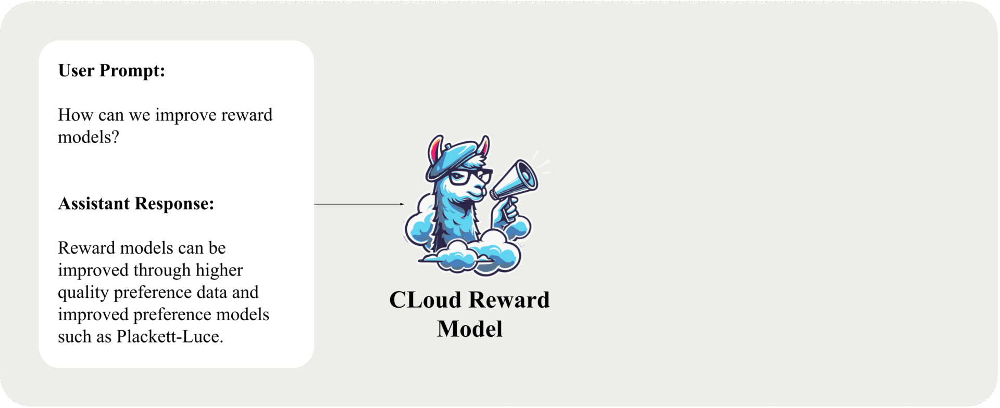

<h1 align="center">
  <u>C</u>ritique-out-<u>Loud</u> Reward Models (CLoud)
</h1>
<p align="center">
  
</p>


<p align="center">
| <a href="https://arxiv.org/abs/2408.11791"><b>Paper</b></a> | <a href="https://x.com/ZackAnkner/status/1826607200376336478"> <b>Tweet</b> </a> |
</p>

---
## Introduction

<u>C</u>ritique-out-<u>Loud</u> reward models are reward models that can reason explicitly about the quality of an input through producing Chain-of-Thought like critiques of an input before predicting a reward.
In classic reward model training, the reward model is trained as a reward head initialized on top of the base LLM.
Without LM capabilities, classic reward models act as encoders and must predict rewards within a single forward pass through the model, meaning reasoning must happen implicitly.
In contrast, CLoud reward models are trained to both produce explicit reasoning about quality and to score based on these critique reasoning traces.
CLoud reward models lead to large gains for pairwise preference modeling on RewardBench, and also lead to large gains in win rate when used as the scoring model in Best-of-N sampling on ArenaHard.

## Todo

- [x] Release models and inference examples
- [ ] Post example training run logs
- [ ] Add ArenaHard evaluation code
- [x] Add VLLM support for inference

## Table of Contents
- [Introduction](#introduction)
- [Todo](#todo)
- [Table of Contents](#table-of-contents)
- [Setup](#setup)
- [Model Weights](#model-weights)
- [Inference](#inference)
- [Dataset](#dataset)
- [Training](#training)
  - [CLoud Training](#cloud-training)
  - [Classic Training](#classic-training)
- [Evaluation](#evaluation)
- [Citation](#citation)

## Setup
```bash
git clone https://github.com/zankner/CLoud
cd CLoud
pip install -e .
```
Optional: base docker image used during development `mosaicml/pytorch:2.3.0_cu121-python3.11-ubuntu20.04`

## Model Weights

| Base Model   |   RM Type      | Hugging Face Repo                                                     |
| ----------  | --------------- |--------------------------------------------------------------------- |
| Llama3-8B   | Classic | [ankner/Llama3-8B-Classic-RM](https://huggingface.co/ankner/Llama3-8B-Classic-RM)   |
| Llama3-8B   |  CLoud | [ankner/Llama3-8B-CLoud-RM](https://huggingface.co/ankner/Llama3-8B-CLoud-RM)   |
| Llama3-70B  |  Classic | [ankner/Llama3-70B-Classic-RM](https://huggingface.co/ankner/Llama3-70B-Classic-RM) |
| Llama3-70B  |  CLoud | [ankner/Llama3-70B-CLoud-RM](https://huggingface.co/ankner/Llama3-70B-CLoud-RM) |

## Inference
We now support VLLM for CLoud model inference.
The code for performing inference lives within the `cloud/inference` folder.
There are two ways to perform VLLM inference.
The easiest way is to directly call the `CLoudAPI` class and let it spin up the models for you.
As an example you can run the following:
```python
api = CLoudAPI(model="ankner/Llama3-8B-CLoud-RM", hosted=False)
critique, reward = api.get_reward(
    user_prompt="Write me a story",
    assistant_response="No I don't want to do that.",
    max_tokens=2048,
    temperature=1e-5
)
print("Critique:", critique)
print("Reward:", reward)
```
The second way is to spin up the VLLM server yourself.
In a separate terminal run the following: `python cloud/inference/serve_cloud.py --model {hf-model-name} {vllm-args}` where `{vllm-args}` accepts all arguments that a vllm openai server accepts.
After the server is running you can perform inference the same as the above example except you should specifiy that the model is being hosted on the vllm server:
```python
api = CLoudAPI(model="ankner/Llama3-8B-CLoud-RM", hosted=False)
```
For a more in depth example of performing VLLM inference for CLoud models please refer to `cloud/eval/eval.py`.

We provide a gradio demo which can be run as follows: `gradio cloud/demos/general_demo.py`. By default this will demo `ankner/Llama3-8B-CLoud-RM`, but you can change the model loaded in the script.
We also provide a more in-depth demo for RewardBench.
This demo assumes that both a classic and CLoud reward model are being hosted.
This means before running the demo you should spin up both a CLoud and Classic reward model following the instruction above.
`gradio cloud/demos/reward_bench_demo.py`.

<details>
<summary>HF native inference</summary>

We also do provide a method to perform inference just using standard transformers.
While this isn't reccomended as its slow, below is an example:
```python
from cloud.model import CLoudRewardModel
from transformers import AutoTokenizer

model_name = "ankner/Llama3-8B-Cloud-RM" # Replace with RM trained with this repo
model = CLoudRewardModel.from_pretrained(model_name, device_map="cuda")
tokenizer = AutoTokenizer.from_pretrained(model_name, padding_side="left")

user_prompt = [
  "Write me a story", 
  "What is the capital of the moon?"
]
assistant_response = [
  "No I don't want to do that.", 
  "Since the moon is made out of cheese, the capital is mozzerella."
]

rewards, critiques = model.predict_reward(user_prompt, assistant_response, tokenizer)

for reward, critique in zip(rewards, critiques):
    print("Critique:")
    print(critique)
    print("Reward:")
    print(reward)
    print("=" * 100)
```

</details>

## Dataset

We provide code to reconstruct the datasets used in the paper.
There are two datasets to build for training, one with oracle critiques meant to simmulate human feedback and one with self-generated critiques.
To build the oracle critique dataset run:
```bash
python cloud/data/build_official_ultra_llama.py --mode oracle
```
To build the self-generated critique dataset run:
```bash
python cloud/data/build_official_ultra_llama.py --mode self-gen --model-size {model-size}
```
where ```{model-size}``` is the size of the model you are using (e.g. 8b, 70b).

<details>
<summary>Build your own dataset from scratch</summary>

1. <b>Build prompts</b> - You can use any dataset you like as long as it has ```prompt``` and ```id``` columns. If you would like to build prompts from UltraFeedback and UltraInteract as we do in the paper run:
    ```bash
    python cloud/data/build_ultra_prompts.py --save-name {name-to-save-as}
    ```
2. <b>Build chosen / rejected responses</b>
    ```bash
    python cloud/data/build_judgements.py --gen-model {model-generating-responses} --judge-model {model-judging-responses} --base-dataset {path-to-prompt-dataset} --save-name {name-to-save-as}
    ```
    The above command requires a hosted generating and judging model. To host the models using vllm run:
    ```bash
    python -m vllm.entrypoints.openai.api_server --model {path-to-gen/judge-model} --dtype bfloat16 --tensor-parallel-size {num-gpus} --port {8000 for gen and 8001 for judge}
    ```
3. <b>Build critiques</b>
    ```bash
    python cloud/data/generate_oracle_critiques.py --judge-model {model-generating-critiques} --base-dataset {path-to-responses-dataset} --save-name {name-to-save-as}
    ```
    Again, this command assumes a hosted critique model. To host the critique model you can use the above vllm command (This time just use port 8000 for the judge model).

</details>


## Training


Before training, you must run the [setup script](#setup) and build the [datasets](#dataset).
The training configs are located in the ```cloud/train/configs/``` folder.
We have already set the optimal hyperparameters that we found for each model as reported in the paper.
The only parameter that needs to be set is the ```variables.micro_batch_size``` parameter, in accordance with your GPU memory.

If you want to log the training runs, uncomment the ```loggers``` section in the config and fill in your wandb settings.

Checkpoints will be saved throughout training to the ```save_folder``` parameter, which is ```ckpts/${variables.run_name}``` by default. The final checkpoint will contain a folder ```hf``` where the huggingface model is saved.


> **Warning**: The below training scripts for both CLoud and Classic prefill the dataset names to be the datasets we release. If you would like to train on your own dataset, you will need to follow the directions to build said dataset in the [dataset section](#dataset) and change the ```variables.dataset_path``` parameter in the training configs.


### CLoud Training

1. The first step is to finetune the base model to produce critiques:

    ```bash
    composer -n {num_gpus} cloud/train/train.py cloud/train/configs/{model_size}_critique_sft.yaml
    ```
    Replace ```{model_size}``` with the size of the model you are training (e.g. 8b, 70b).

2. (Optional if you want to use the self-generated data we release) After the critique SFT model is trained, you need to regenerate the dataset with the critiques.
    To do so, you first need to serve the critique SFT model. To do so locally using vllm run:
    ```bash
    python -m vllm.entrypoints.openai.api_server --model {path-to-critique-sft-model} --dtype bfloat16 --tensor-parallel-size {num-gpus}
    ```
    Then run the data building script:
    ```bash
    python cloud/data/generate_self_critiques.py --model {path-to-critique-sft-model} --base-dataset {path-to-base-dataset} --upload-name {path-to-save-dataset}
    ```

3. After building the self-generated dataset, we can train the CLoud model:
    ```bash
    composer -n {num_gpus} cloud/train/train.py cloud/train/configs/{model_size}_cloud.yaml
    ```

### Classic Training

To train a classic reward model, you can use the following command:
```bash
composer -n {num_gpus} cloud/train/train.py cloud/train/configs/{model_size}_classic.yaml
```

## Evaluation

To run evaluation for a given benchmark run the following command:
```bash
python cloud/eval/eval.py --model-path {path-to-model} --benchmark {benchmark-name}
```
Currently, we only support the RewardBench benchmark.

## Citation
If you found our work useful please consider citing it:
```bibtex
@misc{ankner2024critiqueoutloudrewardmodels,
      title={Critique-out-Loud Reward Models}, 
      author={Zachary Ankner and Mansheej Paul and Brandon Cui and Jonathan D. Chang and Prithviraj Ammanabrolu},
      year={2024},
      eprint={2408.11791},
      archivePrefix={arXiv},
      primaryClass={cs.LG},
      url={https://arxiv.org/abs/2408.11791}, 
}
```